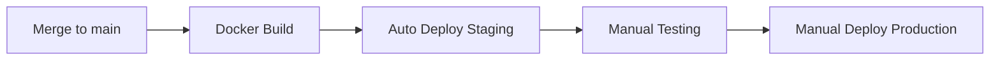

# 🚀 CI/CD Pipeline Guide

완전 자동화된 GitHub Actions 기반 CI/CD 파이프라인 가이드

## 📋 목차

- [현재 저장소 기준 배포 게이트 정책 (중요)](#-현재-저장소-기준-배포-게이트-정책-중요)

- [Pipeline 개요](#pipeline-개요)
- [Workflows 설명](#workflows-설명)
- [환경 설정](#환경-설정)
- [사용 방법](#사용-방법)
- [트러블슈팅](#트러블슈팅)
- [Best Practices](#best-practices)

---

## 🔔 현재 저장소 기준 배포 게이트 정책 (중요)

실제 운영 중인 `.github/workflows/deploy.yml`은 아래 규칙으로 동작합니다.

- `push` to `master`: **배포 전 테스트 검증만 수행**
- `workflow_dispatch`: `deploy_mode` 입력값을 받음 (`check` / `accept`)
  - `check`: 테스트만 수행하고 배포는 스킵
  - `accept`: 테스트 성공 시에만 self-hosted 러너에서 Docker Compose 배포 실행

즉, CD는 **수동 승인(accept 모드)** 이 있어야만 진행됩니다.

---

## 🏗️ Pipeline 개요

### 아키텍처 다이어그램

```
┌─────────────────────────────────────────────────────────────┐
│                     GitHub Repository                        │
│                                                              │
│  ┌──────────┐  ┌──────────┐  ┌──────────┐  ┌─────────────┐ │
│  │  Code    │  │   PR     │  │  Merge   │  │   Release   │ │
│  │  Push    │  │  Open    │  │  to Main │  │   Tag v*    │ │
│  └────┬─────┘  └────┬─────┘  └────┬─────┘  └──────┬──────┘ │
└───────┼─────────────┼─────────────┼────────────────┼────────┘
        │             │             │                │
        ▼             ▼             ▼                ▼
┌───────────┐  ┌──────────┐  ┌──────────┐  ┌──────────────┐
│    CI     │  │    PR    │  │  Docker  │  │   Release    │
│ Code Test │  │Automation│  │  Build   │  │  Creation    │
└───────────┘  └──────────┘  └────┬─────┘  └──────────────┘
                                   │
                                   ▼
                            ┌────────────┐
                            │   ghcr.io  │
                            │  Registry  │
                            └──────┬─────┘
                                   │
                                   ▼
                            ┌────────────┐
                            │ K8s Deploy │
                            │  Staging/  │
                            │ Production │
                            └────────────┘
```

### Pipeline 흐름

1. **개발 단계**: 브랜치에 코드 푸시 → CI 테스트 자동 실행
2. **PR 단계**: PR 생성 → 자동 검증, 라벨링, 코드 리뷰
3. **빌드 단계**: Main 브랜치 머지 → Docker 이미지 빌드 & 푸시
4. **배포 단계**: 이미지 준비 완료 → K8s 자동 배포 (staging)
5. **릴리즈 단계**: 태그 생성 → GitHub Release & 프로덕션 배포

---

## 📝 Workflows 설명

### 1️⃣ CI - Code Quality & Tests (`ci.yml`)

**트리거:**
- `push` to branches: `main`, `develop`, `claude/**`
- `pull_request` to branches: `main`, `develop`

**주요 작업:**

#### Job: `lint-and-test`
- ✅ Python 3.11 환경 설정
- ✅ 의존성 설치
- ✅ Flake8 린팅 (문법 오류 체크)
- ✅ 기본 문법 검증
- ✅ Import 검증
- ✅ Docker 빌드 검증

#### Job: `code-quality`
- ✅ 코드 복잡도 분석 (Radon)
- ✅ 유지보수성 지수 계산
- ✅ 보안 취약점 스캔 (Bandit)

**실행 예시:**
```bash
# 자동 트리거 (push/PR 시)
git push origin feature-branch
```

---

### 2️⃣ Docker Build & Push (`docker-build.yml`)

**트리거:**
- `push` to `main` 브랜치
- `push` tags `v*.*.*`
- `pull_request` to `main`
- Manual trigger (`workflow_dispatch`)

**주요 작업:**

#### Job: `build-and-push`
- 🐳 Docker Buildx 설정 (멀티 플랫폼 빌드)
- 🔐 GitHub Container Registry 로그인
- 🏷️ 이미지 태그 생성:
  - `latest` (main 브랜치)
  - `v1.2.3` (semantic version)
  - `main-abc123` (git SHA)
  - `pr-42` (PR 번호)
- 📦 이미지 빌드 & 푸시 (PR은 빌드만)
- 📋 SBOM 생성 (Software Bill of Materials)

#### Job: `image-scan`
- 🔒 Trivy 보안 스캔
- 📊 결과를 GitHub Security에 업로드

**생성되는 이미지:**
```
ghcr.io/<username>/crawler-more-more/crawler:latest
ghcr.io/<username>/crawler-more-more/crawler:v1.0.0
ghcr.io/<username>/crawler-more-more/crawler:main-abc1234
```

**수동 실행:**
```bash
# GitHub UI에서 Actions > Docker Build & Push > Run workflow
# 또는 gh CLI 사용
gh workflow run docker-build.yml
```

---

### 3️⃣ Deploy to Kubernetes (`deploy-k8s.yml`)

**트리거:**
- Manual trigger (`workflow_dispatch`)
- Docker 빌드 완료 후 자동 실행 (main 브랜치)

**주요 작업:**

#### Job: `deploy`
- 🔧 kubectl 설정
- 🚀 K8s Deployment 이미지 업데이트
- ⏳ Rollout 상태 모니터링 (5분 타임아웃)
- ✅ 배포 검증 (Pod 상태 확인)
- 🧪 Smoke 테스트 (Redis, PostgreSQL 연결)
- ⚠️ 실패 시 자동 Rollback

#### Job: `update-manifests` (GitOps)
- 📝 K8s manifest 파일 업데이트
- 🔄 Git에 커밋 & 푸시 (프로덕션 배포만)

**환경 선택:**
- `staging` (기본값)
- `production`

**수동 배포:**
```bash
# GitHub UI에서
Actions > Deploy to Kubernetes > Run workflow
  Environment: staging/production
  Image tag: latest/v1.0.0
```

**자동 배포 흐름:**
```
main 브랜치 push
  → Docker 이미지 빌드
  → 빌드 성공
  → Staging 환경에 자동 배포
```

---

### 4️⃣ PR Automation (`pr-automation.yml`)

**트리거:**
- PR 생성, 업데이트, 재오픈

**주요 작업:**

#### Job: `pr-validation`
- ✅ PR 제목 형식 검증 (Conventional Commits)
  - `feat: add new feature`
  - `fix(crawler): resolve timeout`
- ✅ PR 크기 체크 (50+ 파일 또는 1000+ 줄 경고)
- ✅ Merge conflict 감지

#### Job: `code-review`
- 🔍 자동 코드 리뷰
- 📊 복잡도 분석 결과 PR에 코멘트

#### Job: `performance-check`
- ⚡ 성능 관련 파일 수정 감지
- ⚠️ 성능 테스트 필요 알림

#### Job: `label-pr`
- 🏷️ 자동 라벨링:
  - `ci/cd` (workflow 파일 수정)
  - `kubernetes` (K8s 매니페스트 수정)
  - `docker` (Dockerfile 수정)
  - `documentation` (README 등)
  - `tests`, `monitoring` 등

**PR 제목 예시:**
```
✅ feat: add KEDA autoscaling
✅ fix(crawler): resolve memory leak
✅ docs: update CI/CD guide
❌ Update crawler.py (형식 오류)
```

---

### 5️⃣ Release (`release.yml`)

**트리거:**
- Tag push `v*.*.*`
- Manual trigger with version input

**주요 작업:**

#### Job: `create-release`
- 📝 자동 Changelog 생성
  - Features, Bug Fixes, Documentation, Improvements 분류
  - 이전 태그와 비교하여 커밋 목록 추출
- 🎉 GitHub Release 생성

#### Job: `build-release-assets`
- 📦 Release assets 생성:
  - `k8s-manifests-v1.0.0.tar.gz` (K8s 매니페스트)
  - `crawler-source-v1.0.0.tar.gz` (소스 코드)
  - `checksums.txt` (SHA256 체크섬)

#### Job: `notify-release`
- 📢 릴리즈 성공 요약 생성

**릴리즈 생성:**
```bash
# 로컬에서 태그 생성
git tag -a v1.0.0 -m "Release v1.0.0"
git push origin v1.0.0

# 또는 GitHub UI에서 수동 실행
Actions > Release > Run workflow
  Version: v1.0.0
```

**자동 생성되는 Changelog 예시:**
```markdown
## 🚀 What's New in v1.0.0

### ✨ Features
- feat: add Prometheus monitoring (abc123)
- feat: implement KEDA autoscaling (def456)

### 🐛 Bug Fixes
- fix(crawler): resolve timeout issue (ghi789)

### 📚 Documentation
- docs: add CI/CD guide (jkl012)
```

---

## ⚙️ 환경 설정

### 필수 GitHub Secrets

#### 1. K8s 배포용 Secrets

```bash
# Kubeconfig 파일을 Base64로 인코딩
cat ~/.kube/config | base64 > kubeconfig.b64
```

**GitHub Repository Settings > Secrets and variables > Actions:**

| Secret 이름 | 설명 | 생성 방법 |
|------------|------|----------|
| `KUBE_CONFIG` | K8s 클러스터 접근용 kubeconfig | Base64 인코딩된 kubeconfig 파일 |

**설정 방법:**
1. GitHub Repository → Settings
2. Secrets and variables → Actions
3. New repository secret
4. Name: `KUBE_CONFIG`
5. Value: `<kubeconfig.b64 내용 붙여넣기>`

#### 2. Docker Registry (자동 설정됨)

GitHub Container Registry는 `GITHUB_TOKEN`을 자동으로 사용하므로 별도 설정 불필요.

### 선택적 Secrets

| Secret 이름 | 설명 | 사용 위치 |
|------------|------|----------|
| `SLACK_WEBHOOK` | Slack 알림용 | 배포 완료 알림 |
| `DISCORD_WEBHOOK` | Discord 알림용 | 릴리즈 알림 |

### GitHub Environments 설정

**프로덕션 배포 보호:**

1. Settings → Environments → New environment
2. Environment name: `production`
3. Protection rules:
   - ✅ Required reviewers (1명 이상 승인)
   - ✅ Wait timer: 5분 (실수 방지)
4. Save protection rules

**Staging 환경:**
- 별도 보호 규칙 없이 자동 배포

---

## 🎯 사용 방법

### 개발 워크플로우

#### 1. 새 기능 개발

```bash
# 1. Feature 브랜치 생성
git checkout -b feat/new-crawler-optimization

# 2. 코드 작성 및 커밋
git add .
git commit -m "feat: optimize crawler semaphore limit"

# 3. Push (CI 자동 실행)
git push origin feat/new-crawler-optimization

# 4. GitHub에서 PR 생성
# - PR 제목: "feat: optimize crawler semaphore limit"
# - 자동으로 CI, PR Automation 실행
```

#### 2. PR 리뷰 & 머지

```bash
# PR 승인 후 main 브랜치에 머지
# → 자동으로 Docker 이미지 빌드
# → Staging 환경에 자동 배포
```

#### 3. 프로덕션 배포

**Option A: 수동 배포 (권장)**
```bash
# GitHub UI에서
Actions > Deploy to Kubernetes > Run workflow
  Environment: production
  Image tag: latest (또는 특정 버전)
```

**Option B: 릴리즈 태그로 배포**
```bash
git tag -a v1.0.0 -m "Release v1.0.0"
git push origin v1.0.0

# → Release workflow 실행
# → Docker 이미지 v1.0.0 태그로 빌드
# → 수동으로 프로덕션 배포 트리거
```

### Conventional Commits 가이드

PR 제목과 커밋 메시지는 아래 형식을 따라야 합니다:

```
<type>(<scope>): <description>

[optional body]

[optional footer]
```

**Types:**
- `feat`: 새로운 기능
- `fix`: 버그 수정
- `docs`: 문서 수정
- `style`: 코드 포맷팅 (기능 변경 없음)
- `refactor`: 리팩토링
- `perf`: 성능 개선
- `test`: 테스트 추가/수정
- `chore`: 빌드, 설정 파일 수정
- `ci`: CI/CD 설정 변경

**Scopes (선택적):**
- `crawler`: 크롤러 코어 로직
- `k8s`: Kubernetes 관련
- `monitoring`: 모니터링 시스템
- `docker`: Docker 관련

**예시:**
```bash
feat(crawler): add retry mechanism for failed requests
fix(k8s): resolve memory leak in deployment
docs: update deployment guide
perf(crawler): optimize semaphore limit to 200
ci: add automated security scanning
```

---

## 🔧 트러블슈팅

### Docker 빌드 실패

**문제:** `Error building image`

**해결:**
```bash
# 1. 로컬에서 빌드 테스트
cd crawler-challenge
docker build -t test .

# 2. Dockerfile 문법 검증
docker build --no-cache -t test . --target builder

# 3. 로그 확인
# GitHub Actions > Docker Build & Push > 실패한 workflow > 로그
```

### K8s 배포 실패

**문제:** `Error: KUBE_CONFIG not found`

**해결:**
```bash
# 1. Secret 확인
# Settings > Secrets > KUBE_CONFIG 존재 확인

# 2. Base64 인코딩 재생성
cat ~/.kube/config | base64 -w 0 > kubeconfig.b64

# 3. Secret 업데이트
```

**문제:** `Error: connection refused to cluster`

**해결:**
```bash
# 1. kubeconfig 유효성 검증
kubectl --kubeconfig=<파일> get nodes

# 2. 클러스터 접근 권한 확인
kubectl auth can-i create deployments -n crawler

# 3. Service Account 권한 확인 (K8s RBAC)
```

### PR Validation 실패

**문제:** `PR title must follow conventional commits format`

**해결:**
```bash
# PR 제목을 아래 형식으로 변경:
feat: add new feature
fix(scope): bug description
docs: update guide
```

### Release Changelog 생성 실패

**문제:** 빈 Changelog

**해결:**
```bash
# 이전 태그 확인
git tag -l

# 수동으로 Changelog 생성 (필요시)
git log v1.0.0..v1.1.0 --pretty=format:"- %s (%h)"
```

---

## 🏆 Best Practices

### 1. 브랜치 전략

```
main (프로덕션)
  └── develop (개발)
       ├── feat/feature-1
       ├── feat/feature-2
       └── fix/bug-fix
```

- `main`: 항상 프로덕션 배포 가능한 상태
- `develop`: 통합 브랜치
- `feat/*`, `fix/*`: 기능/버그 수정 브랜치

### 2. 배포 전략

**Staging → Production 2단계 배포:**



**블루-그린 배포 (고급):**
- 현재 배포 중지 없이 새 버전 배포
- K8s Service로 트래픽 전환

### 3. 모니터링

**배포 후 필수 체크:**
```bash
# 1. Pod 상태 확인
kubectl get pods -n crawler -w

# 2. 로그 확인
kubectl logs -n crawler -l app=crawler-worker --tail=100 -f

# 3. Grafana 대시보드 확인
# - CPU/메모리 사용량
# - Redis 큐 길이
# - 크롤링 성능
```

### 4. Rollback 전략

**자동 Rollback:**
- Deploy workflow는 실패 시 자동 rollback

**수동 Rollback:**
```bash
# 1. 이전 버전 확인
kubectl rollout history deployment/crawler-worker -n crawler

# 2. Rollback
kubectl rollout undo deployment/crawler-worker -n crawler

# 또는 특정 리비전으로
kubectl rollout undo deployment/crawler-worker -n crawler --to-revision=3
```

### 5. 보안

**Docker 이미지:**
- ✅ Multi-stage build (이미지 크기 최소화)
- ✅ Non-root user 사용
- ✅ Trivy 보안 스캔
- ✅ SBOM 생성

**K8s:**
- ✅ Secret으로 민감 정보 관리
- ✅ NetworkPolicy 설정 (선택적)
- ✅ RBAC 최소 권한 원칙

**GitHub:**
- ✅ Protected branches (main, develop)
- ✅ Required PR reviews
- ✅ Environment protection rules

### 6. 성능 최적화

**Docker 빌드:**
```yaml
# 빌드 캐시 활용
cache-from: type=gha
cache-to: type=gha,mode=max
```

**K8s 배포:**
```yaml
# Rolling update 전략
strategy:
  type: RollingUpdate
  rollingUpdate:
    maxSurge: 1
    maxUnavailable: 0
```

---

## 📊 Workflow 실행 통계

### 예상 실행 시간

| Workflow | 평균 시간 | 트리거 빈도 |
|----------|----------|-----------|
| CI | 2-3분 | 모든 push |
| Docker Build | 5-7분 | main 머지 |
| K8s Deploy | 3-5분 | 수동/자동 |
| PR Automation | 1-2분 | 모든 PR |
| Release | 2-3분 | 태그 push |

### GitHub Actions 사용량

**무료 Tier (Public Repo):**
- ✅ 무제한 실행 시간
- ✅ 무제한 동시 실행

**Private Repo:**
- 월 2,000분 (Free plan)
- 월 3,000분 (Pro plan)

**최적화 팁:**
- 불필요한 workflow 비활성화
- 조건부 실행 활용 (`if` 조건)
- 빌드 캐시 적극 활용

---

## 🔗 참고 자료

- [GitHub Actions 문서](https://docs.github.com/en/actions)
- [Docker Best Practices](https://docs.docker.com/develop/dev-best-practices/)
- [Kubernetes Deployments](https://kubernetes.io/docs/concepts/workloads/controllers/deployment/)
- [Conventional Commits](https://www.conventionalcommits.org/)
- [Semantic Versioning](https://semver.org/)

---

## 📞 지원

**문제 발생 시:**
1. 이 문서의 [트러블슈팅](#트러블슈팅) 섹션 확인
2. GitHub Issues에 버그 리포트 작성
3. Workflow 로그 첨부

**개선 제안:**
- PR로 CI/CD 개선 사항 제안
- Issues에 Feature Request 등록
